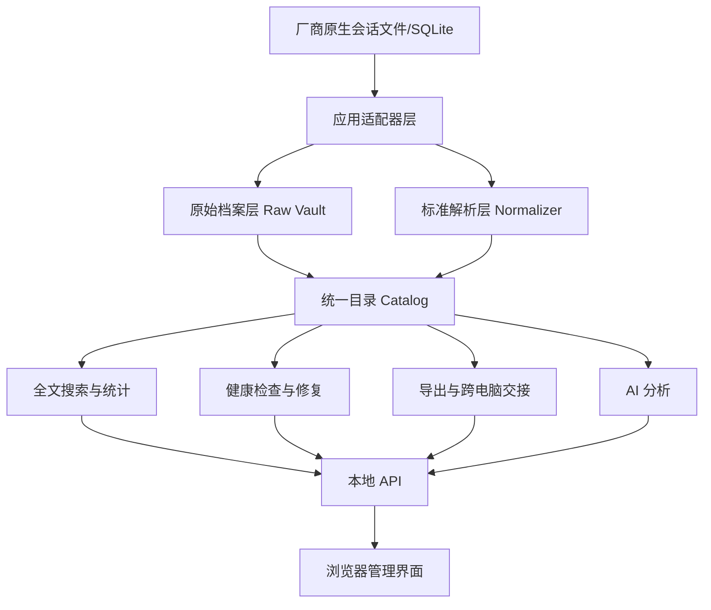

# AI Coding Session Vault — 完整开发方案

> 文档状态：V1.0
>
> 对应代码基线：Agent Session Vault Sync v0.3
>
> 目标：在现有多软件备份、校验与 Codex 隔离恢复能力之上，建设一个本地优先、可搜索、可管理、可修复、可交接、可统计、可分析的 AI 编程会话保险箱。
>
> 说明：本文定义的是下一阶段完整产品和工程方案；除“当前基线”明确列出的能力外，其余模块仍属于待开发范围。

---

## 1. 文档目的

本文是后续产品和工程开发的统一基线，覆盖以下九项能力：

1. 会话管理界面；
2. 修改会话；
3. 跨电脑交接；
4. 备份、修复和恢复可靠性；
5. 多数据源解析和使用量统计；
6. 会话健康检查和修复；
7. 全局搜索和查看；
8. 导出成可读文件；
9. AI 分析。

本文同时定义：

- 产品边界；
- 总体架构；
- 标准数据模型；
- 适配器扩展协议；
- UI 页面和交互；
- 本地 API；
- 安全与隐私规则；
- 测试和验收标准；
- 分期开发顺序；
- 迁移和兼容策略。

---

## 2. 产品定位

### 2.1 一句话定位

**AI Coding Session Vault 是一个跨 AI 编程工具的本地会话保险箱，用于保存、搜索、查看、管理、修复、导出和恢复原生会话。**

### 2.2 核心用户

- 同时使用 Codex、Claude Code、Gemini CLI、Qwen Code、Kimi CLI、OpenCode 等工具的个人开发者；
- 需要跨 Windows、Linux、WSL、远程服务器继续工作的用户；
- 需要保存开发决策、命令、错误处理过程和 AI 输出的项目负责人；
- 担心软件升级、索引损坏、会话清理或电脑迁移导致聊天记录丢失的用户；
- 需要统计不同 AI 工具和模型使用量的重度用户。

### 2.3 产品差异化

本项目不只做查看器，也不只做复制脚本。核心差异是：

```text
多软件原生数据发现
+ 不破坏源文件的增量备份
+ 可重建的统一目录和全文索引
+ 会话健康检查与安全修复
+ 跨电脑可移植交接
+ 原生恢复能力
+ 多格式导出
+ 可追溯的 AI 分析
```

### 2.4 明确不做

现阶段不做：

- 云端账号和云同步平台；
- 实时远程控制 AI Agent；
- 多 Agent 调度和任务编排；
- 默认修改厂商原始聊天正文；
- 默认删除源软件会话；
- 自动上传会话到第三方服务；
- 未经明确授权创建或触发 GitHub Actions；
- 把推测路径当作已支持适配器。

---

## 3. 当前基线

现有 v0.3 已经具备：

- 独立适配器自动发现；
- Codex、Claude Code、Gemini CLI、Qwen Code、Kimi CLI 文件级会话备份；
- OpenCode、Goose、Hermes Agent SQLite 快照；
- Aider 项目滚动历史备份；
- SHA-256 去重；
- 会话继续增长识别；
- 内容分叉冲突保留；
- SQLite Backup API 快照与 `PRAGMA quick_check`；
- 稳定的 `apps/<app_id>/machines/<machine_id>/` 文件夹结构；
- Codex 单会话和整库隔离恢复；
- 本地手动测试；
- 不复制认证文件和 Token。

现有实现适合作为“原始档案层”，但缺少：

- 统一解析后的会话目录；
- 跨软件全文搜索；
- 图形界面；
- Vault 自有标题、标签、收藏和备注；
- 通用健康检查和修复框架；
- 交接包；
- 使用量统计；
- 可读导出；
- AI 派生分析。

---

## 4. 设计原则

### 4.1 原始数据不可变

Vault 中的原始厂商文件是证据和恢复源：

- 默认只读；
- 不直接编辑；
- 不因索引重建而删除；
- 不因源文件消失而自动删除；
- 每个版本都有哈希；
- 修复结果写入新版本或隔离目录。

### 4.2 派生数据可重建

以下内容都属于派生数据：

- 统一会话目录；
- 全文搜索索引；
- 用量统计；
- AI 摘要；
- 导出文件；
- 缩略预览；
- 健康检查报告。

派生数据损坏后，必须能根据原始档案重新生成。

### 4.3 修改必须分层

“修改会话”分成三层：

1. **Vault 元数据修改**：标题、标签、收藏、备注、项目归类，可直接修改；
2. **派生副本修改**：清理后的 Markdown、修复后的会话副本、AI 摘要，可修改并保留版本；
3. **原生应用修改**：原生重命名、归档、恢复，仅当适配器明确声明能力时允许，必须先预览并支持回滚。

任何功能都不能把“编辑 Vault 标题”等同于直接篡改原始 JSONL。

### 4.4 本地优先

- 默认仅访问本地文件；
- Web 服务只监听 `127.0.0.1`；
- AI 分析默认关闭远程上传；
- 远程模型必须显式启用；
- 远程分析前提供脱敏预览；
- API Key 存储与会话 Vault 分离。

### 4.5 能力声明而不是猜测

每个适配器需要声明自己支持的能力，例如：

```text
discover
archive
parse
usage
health
repair
native_rename
native_archive
native_restore
handoff
```

核心和 UI 根据能力显示按钮，不能对所有软件显示不可用的操作。

### 4.6 开发期间不使用 GitHub Actions

- 不新增 `.github/workflows/`；
- 不自动触发 push 或 PR Workflow；
- 使用本地静态检查、单元测试和临时目录集成测试；
- 需要远端 CI 时必须另行获得明确授权。

---

## 5. 总体架构

### 5.1 分层架构



### 5.2 推荐技术栈

#### 后端

- Python 3.10+；
- FastAPI；
- Pydantic；
- SQLite；
- SQLite FTS5；
- Uvicorn；
- 继续保留现有 CLI；
- 所有核心功能先实现为 Python 服务层，CLI 和 Web API 共用。

#### 前端

推荐：

- React + TypeScript + Vite；
- TanStack Query；
- 虚拟列表，用于长会话和大量搜索结果；
- 图表使用轻量图表库；
- 前端构建产物提交为静态资源，最终用户不需要安装 Node.js。

后续可使用 Tauri 封装桌面版，但第一阶段以本地 Web UI 为主。

### 5.3 目标代码结构

```text
scripts/
  vault_sync.py                  # 兼容 CLI 入口

src/session_vault/
  adapters/                      # 厂商适配器
  archive/                       # 原始备份和版本管理
  catalog/                       # 统一目录与数据库迁移
  parsers/                       # 标准化解析
  search/                        # FTS 与查询
  health/                        # 检查器
  repairs/                       # 修复计划和执行器
  restore/                       # 原生恢复
  handoff/                       # 跨电脑交接包
  exports/                       # Markdown/HTML/JSON 导出
  usage/                         # Token、模型、成本统计
  analysis/                      # AI 分析任务
  api/                           # FastAPI 路由
  services/                      # 用例服务层
  security/                      # 脱敏、密钥扫描、路径安全
  cli/                           # CLI 命令

web/
  src/
    pages/
    components/
    api/
    stores/
  dist/                          # 发布时的静态资源

tests/
  fixtures/
  unit/
  integration/
  restore/
  repair/

docs/
```

为了兼容现有仓库，可以分阶段迁移，不要求一次性移动全部模块。

---

## 6. Vault 文件结构升级

保留现有原始结构，并增加可重建目录：

```text
AgentSessionVault/
├── vault.json
├── apps/
│   └── <app_id>/machines/<machine_id>/
│       ├── native/
│       ├── metadata/
│       ├── conflicts/
│       ├── reports/
│       └── manifest.json
├── catalog/
│   ├── catalog.db
│   ├── schema.json
│   └── rebuild-state.json
├── derived/
│   ├── exports/
│   ├── analysis/
│   ├── previews/
│   └── repair-plans/
├── handoff/
│   ├── packages/
│   └── imports/
├── quarantine/
├── logs/
└── settings.json
```

规则：

- `apps/` 是不可随意修改的原始档案；
- `catalog/` 可删除后重建；
- `derived/` 可删除后重建；
- `handoff/` 是用户主动生成的交接包；
- `quarantine/` 保存修复前副本和软删除内容；
- `settings.json` 不保存明文 API Key。

---

## 7. 标准化数据模型

### 7.1 统一会话对象

```python
class NormalizedSession:
    session_uid: str
    app_id: str
    machine_id: str
    native_session_id: str
    project_uid: str | None
    title_native: str | None
    title_vault: str | None
    cwd_original: str | None
    repository_url: str | None
    git_branch: str | None
    git_commit: str | None
    model_ids: list[str]
    provider_ids: list[str]
    started_at: datetime | None
    updated_at: datetime | None
    archived_native: bool | None
    health_status: str
    source_version: int
    source_hash: str
    parser_version: str
```

`session_uid` 由以下内容稳定生成：

```text
app_id + machine_id + native_session_id
```

### 7.2 统一消息对象

```python
class NormalizedMessage:
    message_uid: str
    session_uid: str
    native_message_id: str | None
    parent_message_uid: str | None
    sequence: int
    role: str
    message_type: str
    text_content: str | None
    raw_content_json: str | None
    created_at: datetime | None
    model_id: str | None
    input_tokens: int | None
    output_tokens: int | None
    cached_tokens: int | None
    reasoning_tokens: int | None
```

### 7.3 工具调用对象

```python
class NormalizedToolCall:
    tool_call_uid: str
    session_uid: str
    message_uid: str | None
    native_tool_call_id: str | None
    tool_name: str
    arguments_json: str | None
    result_text: str | None
    status: str | None
    started_at: datetime | None
    completed_at: datetime | None
```

### 7.4 使用量对象

```python
class UsageRecord:
    usage_uid: str
    session_uid: str
    message_uid: str | None
    app_id: str
    provider_id: str | None
    model_id: str | None
    timestamp: datetime
    input_tokens: int
    output_tokens: int
    cached_read_tokens: int
    cached_write_tokens: int
    reasoning_tokens: int
    tool_tokens: int
    actual_cost: Decimal | None
    estimated_cost: Decimal | None
    cost_type: str
    pricing_version: str | None
```

`cost_type` 必须区分：

- `actual`：数据源明确提供的实际金额；
- `estimated_api_equivalent`：根据价格表估算的 API 等价成本；
- `subscription_unknown`：订阅额度，无法映射真实扣费；
- `unavailable`：无法计算。

严禁把估算值显示成真实消费。

### 7.5 Vault 自有元数据

```python
class VaultSessionMetadata:
    session_uid: str
    custom_title: str | None
    note: str | None
    pinned: bool
    favorite: bool
    vault_archived: bool
    protected_from_cleanup: bool
    custom_project_uid: str | None
    updated_at: datetime
```

### 7.6 推荐数据库表

```text
apps
machines
projects
sessions
session_artifacts
messages
tool_calls
file_references
usage_records
vault_session_metadata
tags
session_tags
health_runs
health_findings
repair_plans
repair_operations
restore_runs
handoff_packages
exports
analysis_jobs
analysis_results
pricing_tables
schema_migrations
```

---

## 8. 适配器协议升级

现有 `AdapterSpec` 只描述路径和基础恢复能力。下一版需要拆成声明和运行能力。

### 8.1 适配器声明

```python
@dataclass(frozen=True)
class AdapterCapabilities:
    archive: bool = True
    parse: bool = False
    usage: bool = False
    health: bool = False
    repair: bool = False
    native_rename: bool = False
    native_archive: bool = False
    native_restore: bool = False
    handoff: bool = False
```

### 8.2 解析接口

```python
class SessionParser(Protocol):
    def detect_format(self, artifact: Path) -> bool: ...
    def parse_session(self, source: SessionSource) -> NormalizedSession: ...
    def iter_messages(self, source: SessionSource) -> Iterator[NormalizedMessage]: ...
    def iter_tool_calls(self, source: SessionSource) -> Iterator[NormalizedToolCall]: ...
    def iter_usage(self, source: SessionSource) -> Iterator[UsageRecord]: ...
```

### 8.3 健康检查接口

```python
class HealthChecker(Protocol):
    def run(self, source: SessionSource) -> list[HealthFinding]: ...
```

### 8.4 修复接口

```python
class RepairProvider(Protocol):
    def plan(self, finding: HealthFinding) -> RepairPlan: ...
    def apply(self, plan: RepairPlan, target: RepairTarget) -> RepairResult: ...
```

修复器不得直接接收任意绝对路径，必须使用已验证的 `RepairTarget`。

### 8.5 原生修改接口

```python
class NativeSessionActions(Protocol):
    def preview_rename(self, session_id: str, title: str) -> ChangePlan: ...
    def apply_rename(self, plan: ChangePlan) -> ChangeResult: ...
    def preview_archive(self, session_id: str) -> ChangePlan: ...
    def apply_archive(self, plan: ChangePlan) -> ChangeResult: ...
```

只有官方格式稳定且有测试的适配器才能实现。

---

## 9. 功能模块一：会话管理界面

### 9.1 页面结构

左侧导航：

```text
总览
会话
项目
全局搜索
健康检查
修复记录
跨电脑交接
导出
使用量
AI 分析
设置
```

### 9.2 总览页

展示：

- Vault 状态；
- 最后备份时间；
- 各软件会话数量；
- 异常会话数量；
- 最近更新会话；
- 最近恢复和交接任务；
- 存储占用；
- 本月使用量；
- 待处理警告。

### 9.3 会话列表页

列字段：

- 标题；
- 软件图标；
- 项目；
- 电脑；
- 模型；
- 更新时间；
- 消息数；
- 健康状态；
- 收藏或固定；
- 原生归档状态；
- Vault 状态。

筛选：

- 软件；
- 电脑；
- 项目；
- 日期；
- 模型；
- 健康状态；
- 标签；
- 是否收藏；
- 是否可恢复；
- 是否包含工具调用；
- 是否包含错误。

### 9.4 会话详情页

页面区域：

1. 顶部会话信息；
2. 对话时间线；
3. 工具调用折叠区；
4. 文件和命令引用；
5. 使用量；
6. 健康状态；
7. AI 分析；
8. 原始文件和版本；
9. 导出和恢复操作。

长会话必须使用虚拟列表，不能一次渲染所有 DOM。

### 9.5 页面状态

必须设计：

- 正常；
- 正在解析；
- 原文件缺失但 Vault 有备份；
- 索引过期；
- 会话损坏；
- 只读；
- 适配器不支持某项操作；
- 恢复中；
- 导出中；
- AI 分析未启用。

### 9.6 验收标准

- 能查看所有已解析软件的会话；
- 10,000 条会话列表仍可流畅分页；
- 超长会话不会让浏览器失去响应；
- 所有修改操作都有明确作用范围；
- 不支持的原生操作不会显示为可点击按钮。

---

## 10. 功能模块二：修改会话

### 10.1 Vault 内安全修改

第一阶段支持：

- 修改 Vault 标题；
- 添加标签；
- 添加备注；
- 收藏；
- 固定；
- 自定义项目归类；
- Vault 归档；
- 保护不被清理；
- 软删除到隔离区。

这些修改只写入 `catalog.db`，不修改厂商文件。

### 10.2 原生会话修改

按适配器能力逐步支持：

- 原生重命名；
- 原生归档或取消归档；
- 恢复为活动会话；
- 修复原生索引；
- 在新隔离环境中创建可继续的副本。

所有原生修改流程：

```text
选择操作
→ 生成 ChangePlan
→ 显示修改文件、数据库和风险
→ 创建回滚快照
→ 用户确认
→ 原子执行
→ 验证
→ 写入操作记录
```

### 10.3 正文编辑边界

不允许直接覆盖原始对话正文。

需要编辑内容时，提供：

- 派生副本；
- 会话分支；
- 清理版导出；
- 修复副本；
- 交接副本。

每个副本必须指向原始会话和原始哈希。

### 10.4 软删除

软删除移动的是 Vault 管理记录或派生内容，不默认删除源应用记录。

用户主动要求删除原生记录时：

- 必须检查适配器是否支持；
- 必须生成最后备份；
- 必须显示影响范围；
- 默认进入应用支持的回收站或 Vault 隔离区；
- 不提供批量永久删除作为普通操作。

### 10.5 验收标准

- Vault 标题、标签、备注修改不影响原始哈希；
- 原生操作都有 dry-run；
- 失败后能恢复修改前文件；
- 所有修改都记录操作者、时间、输入和结果；
- 原生正文没有无版本覆盖路径。

---

## 11. 功能模块三：跨电脑交接

### 11.1 交接包格式

文件扩展名建议：

```text
<project-or-session>.asvpack
```

本质为 ZIP，但有严格目录：

```text
package.json
manifest.json
checksums.sha256
sessions/
indexes/
project/
  git.json
  path-map.json
  environment.json
analysis/
redaction-report.json
README.txt
```

### 11.2 交接范围

支持：

- 单会话；
- 多会话；
- 整个项目；
- 某台电脑的某个软件；
- 恢复所需最小文件；
- 仅可读导出包。

### 11.3 路径映射

包内不能写死原电脑路径作为目标路径。

保存：

```json
{
  "source": "C:/Users/Leon/Projects/omnibridge",
  "placeholder": "${PROJECT_ROOT}",
  "target_required": true
}
```

导入时用户选择目标项目目录，再生成映射。

### 11.4 敏感信息扫描

导出前扫描：

- API Key；
- OAuth Token；
- 私钥；
- `.env` 内容；
- Cookie；
- Authorization Header；
- 数据库连接串；
- 用户主目录；
- 内网地址；
- 邮箱和手机号，可选；
- 命令中的密码参数。

结果分为：

- 阻止导出；
- 自动脱敏；
- 需要人工确认；
- 可安全保留。

### 11.5 导入预检

导入前检查：

- 包结构；
- SHA-256；
- 路径穿越；
- ZIP Bomb；
- 目标软件版本；
- 目标目录是否存在；
- 当前会话是否冲突；
- 是否需要登录；
- 是否支持原生恢复；
- 项目 Git 状态。

### 11.6 恢复策略

优先顺序：

1. 原生隔离恢复；
2. 原生导入；
3. 重建索引后恢复；
4. 只读查看；
5. Markdown/HTML 交接。

不能恢复时，也必须保证内容可读。

### 11.7 验收标准

- 包被修改后校验失败；
- 包不能写出目标目录；
- 单会话交接不夹带其他会话；
- 默认不包含认证文件；
- 导入失败不会污染现有应用目录；
- 每个交接包有完整报告和恢复说明。

---

## 12. 功能模块四：备份、修复和恢复可靠性

### 12.1 稳定读取

活跃 JSONL 可能正在写入，读取应采用：

```text
读取前 stat
→ 复制到临时文件
→ 读取后 stat
→ 大小和 mtime 一致则接受
→ 变化则重试
```

超过最大重试次数时：

- 标记为 `unstable`；
- 不覆盖最后一个完整版本；
- 下次同步继续。

### 12.2 JSONL 尾部校验

- 允许最后一行暂时不完整；
- 不把不完整尾部发布为新的稳定版本；
- 保存诊断信息；
- 下一次同步合并完整内容。

### 12.3 SQLite 可靠快照

继续使用 Backup API，并增加：

- `quick_check`；
- 可选 `integrity_check`；
- 表清单和 schema hash；
- 快照前后页数；
- WAL 模式记录；
- 数据库版本信息；
- 恢复演练状态。

### 12.4 磁盘与文件系统检查

同步前检查：

- 可用空间；
- Vault 是否可写；
- 文件系统是否支持原子重命名；
- 路径长度；
- 移动硬盘是否突然断开；
- 是否存在过期锁；
- 是否写入同一源目录。

### 12.5 版本策略

建议：

- 新会话：保留当前版本；
- 追加会话：当前版本 + 关键版本；
- 分叉会话：所有冲突版本；
- SQLite：最新 + 最近 N 个历史快照；
- 收藏或保护会话：永不自动清理；
- 清理前生成计划，不直接执行。

### 12.6 内容寻址对象库

后续可引入：

```text
objects/sha256/<前两位>/<完整哈希>
```

原路径仅作为引用，可以减少重复版本占用。

引入时必须保持旧 Vault 可读，迁移可中断、可恢复。

### 12.7 恢复演练

增加只读演练模式：

```bash
vault restore --app codex --scope session --session-id ... --drill
```

演练只验证：

- 文件完整；
- 恢复计划可生成；
- 目标结构合法；
- 启动脚本可生成；
- 不真正发布恢复目录。

### 12.8 验收标准

- 写入中断不会留下半文件；
- 移动硬盘断开不会损坏旧版本；
- 不完整 JSONL 不覆盖稳定版本；
- SQLite 快照可以独立打开；
- 恢复前一定验证哈希；
- 清理和修复都有回滚点。

---

## 13. 功能模块五：多数据源解析与使用量统计

### 13.1 解析流水线

```text
发现原始文件
→ 计算来源版本
→ 选择解析器
→ 标准化会话
→ 标准化消息和工具调用
→ 提取使用量
→ 更新 Catalog
→ 更新全文索引
```

解析器必须幂等：相同来源哈希重复解析不能产生重复记录。

### 13.2 解析状态

每个会话记录：

- 未解析；
- 正在解析；
- 已解析；
- 部分解析；
- 不支持格式；
- 解析失败；
- 等待文件稳定；
- 需要适配器升级。

### 13.3 使用量字段统一

统一字段：

```text
input_tokens
output_tokens
cached_read_tokens
cached_write_tokens
reasoning_tokens
tool_tokens
total_tokens
api_calls
estimated_cost
actual_cost
```

不同软件缺失的字段保持 `NULL`，不能填 0 冒充已知。

### 13.4 价格表

`pricing_tables` 应包含：

- provider；
- model；
- 生效时间；
- 输入价格；
- 输出价格；
- 缓存读写价格；
- 计价单位；
- 来源；
- 版本。

价格表允许：

- 内置版本；
- 用户手动覆盖；
- 导入 JSON；
- 不自动联网更新作为核心依赖。

### 13.5 统计页面

提供：

- 日、周、月趋势；
- 按软件；
- 按项目；
- 按模型；
- 按会话；
- 按电脑；
- Token 构成；
- 缓存使用；
- 工具调用次数；
- 最长会话；
- 估算成本；
- 数据完整度。

### 13.6 数据质量标识

每个统计值显示：

- 完整；
- 部分；
- 估算；
- 不可用。

UI 必须能解释为什么某个工具没有成本数据。

### 13.7 验收标准

- 同一会话重复索引不重复累计；
- 不同来源 Token 字段映射有测试；
- 估算成本与实际成本明显区分；
- 价格表变更不会修改原始 UsageRecord；
- 支持按数据完整度过滤。

---

## 14. 功能模块六：会话健康检查和修复

### 14.1 健康等级

```text
healthy
warning
broken
unrecoverable
unknown
```

### 14.2 通用检查项

所有文件型适配器检查：

- 文件是否存在；
- SHA-256 是否匹配；
- JSONL 是否逐行可解析；
- 是否有不完整尾部；
- 会话 ID 是否一致；
- 时间是否异常回退；
- 文件是否突然缩短；
- 是否出现同 ID 不同内容；
- 索引是否引用缺失文件；
- 原始路径是否逃逸允许目录。

### 14.3 消息链检查

支持父子链的软件检查：

- `parentUuid` 是否存在；
- 是否出现循环；
- 是否有孤儿消息；
- 是否有重复消息 ID；
- 压缩节点是否连接；
- 会话头是否缺失；
- 消息时间是否乱序。

### 14.4 工具调用检查

- tool use 是否有对应 result；
- tool call ID 是否重复；
- 状态是否未结束；
- 工具结果是否截断；
- 结果是否引用不存在的附件。

### 14.5 SQLite 检查

- `quick_check`；
- schema 版本；
- 必要表是否存在；
- 会话行与原始文件是否一致；
- 路径是否存在；
- 重复 thread ID；
- 归档状态是否冲突；
- 回填状态是否卡住。

### 14.6 检查结果模型

```python
class HealthFinding:
    finding_id: str
    session_uid: str | None
    app_id: str
    checker_id: str
    severity: str
    code: str
    summary: str
    evidence_json: str
    repairable: bool
    repair_provider: str | None
```

### 14.7 修复计划

修复不是一个按钮直接改文件，而是：

```python
class RepairPlan:
    plan_id: str
    finding_ids: list[str]
    source_hashes: dict[str, str]
    operations: list[RepairOperation]
    backup_targets: list[str]
    expected_result: dict
    risk_level: str
    reversible: bool
```

### 14.8 第一批修复能力

优先实现：

1. Claude Code 索引重建；
2. Claude Code 缺失父链的安全修复副本；
3. 重复消息 ID 检测和派生副本重新编号；
4. 缺失 tool result 的标记修复；
5. Codex rollout 与数据库差异诊断；
6. Codex 隔离回填环境；
7. 无效 Vault 索引重建；
8. 损坏尾部隔离。

### 14.9 修复目标

修复默认写入：

```text
quarantine/<run-id>/original/
derived/repair-plans/<plan-id>/repaired/
```

只有用户明确选择“应用回原生目录”，且适配器支持时，才执行原生修改。

### 14.10 验收标准

- Doctor 默认只读；
- Repair 默认 dry-run；
- 修复计划绑定源哈希，源变化后计划失效；
- 修复前保留副本；
- 修复后重新执行健康检查；
- 能完整撤销可逆操作；
- 所有修复有审计记录。

---

## 15. 功能模块七：全局搜索与查看

### 15.1 搜索对象

索引：

- 会话标题；
- 用户消息；
- AI 回复；
- 推理摘要，在厂商数据允许时；
- 工具名称；
- 命令；
- 工具结果；
- 文件路径；
- 错误信息；
- Git 分支和 Commit；
- 项目；
- 标签；
- 备注；
- AI 分析结果。

### 15.2 搜索引擎

使用 SQLite FTS5。

为了支持中英文：

- 优先使用 `unicode61` 做词项搜索；
- 可用时增加 `trigram` 索引做中文和子字符串搜索；
- 不支持 trigram 的 SQLite 构建使用应用层 2/3-gram 辅助索引；
- 启动时检测能力，不假设所有环境相同。

### 15.3 查询语法

示例：

```text
auth error
app:codex docker
project:omnibridge "permission denied"
since:30d model:gpt-5.6
has:tool tool:shell
file:panel.ts
health:broken
machine:leon-windows-main
```

### 15.4 搜索结果

每条结果显示：

- 软件；
- 会话标题；
- 项目；
- 时间；
- 命中片段；
- 命中类型；
- 消息位置；
- 健康状态；
- 恢复或导出入口。

### 15.5 索引更新

- 只索引新增或来源版本变化的会话；
- 删除派生索引不影响原始档案；
- 支持全量重建；
- 支持单软件、单电脑、单会话重建；
- 索引任务可暂停和恢复；
- 记录解析器版本。

### 15.6 性能目标

基准目标：

- 10,000 个会话分页查询无明显等待；
- 100,000 条消息常规搜索目标小于 1 秒；
- 1,000,000 条消息在普通 SSD 上目标小于 3 秒；
- 搜索结果支持流式或渐进显示；
- 长文本索引不阻塞 UI。

以上需要基准测试验证，未达标时以结果为准，不在产品中虚假承诺。

### 15.7 验收标准

- 中英文关键词可搜索；
- 能按软件、项目、日期、模型组合筛选；
- 命中后可跳转到具体消息；
- 索引可全量重建；
- 原始文件变化后旧索引不会继续显示为最新；
- 搜索结果不会泄露被脱敏字段。

---

## 16. 功能模块八：导出成可读文件

### 16.1 导出格式

第一阶段：

- Markdown；
- HTML；
- JSON。

第二阶段：

- PDF，通过 HTML 打印或专用渲染器；
- ZIP 项目档案；
- `.asvpack` 交接包。

### 16.2 导出预设

#### Clean Chat

保留：

- 用户消息；
- AI 回复；
- 必要标题和时间。

去掉：

- 系统噪声；
- IDE XML；
- 超长工具输出；
- 重复上下文；
- 隐藏元数据。

#### Technical Audit

保留：

- 完整对话；
- 工具调用；
- 命令；
- 文件路径；
- 错误；
- 模型和使用量；
- 健康状态。

#### Last N Turns

只导出最近指定回合。

#### Full Raw

包含：

- 原始记录；
- 标准化记录；
- manifest；
- 哈希；
- 解析器版本。

#### Project Handoff

面向另一个开发者或模型：

- 项目摘要；
- 决策；
- 当前状态；
- 未完成任务；
- 关键会话链接；
- Git 信息；
- 已脱敏技术对话。

### 16.3 导出过滤

支持：

- 最近 N 个回合；
- 排除推理；
- 排除工具输出；
- 工具输出最大长度；
- 只保留错误；
- 只保留文件修改；
- 隐藏绝对路径；
- 隐藏用户名；
- 自动脱敏；
- 包含或排除使用量。

### 16.4 引用与可追溯

导出中给每条消息稳定锚点：

```text
session_uid
message_uid
native_message_id
source_hash
```

AI 分析引用这些锚点，避免只有摘要没有证据。

### 16.5 HTML 导出

HTML 需支持：

- 左侧目录；
- 角色区分；
- 工具调用折叠；
- 代码高亮；
- 搜索；
- 打印样式；
- 单文件模式；
- 多文件资源模式。

### 16.6 验收标准

- 相同来源和配置生成稳定结果；
- Clean Chat 不包含敏感认证信息；
- 超长工具输出不会导致浏览器卡死；
- JSON 保留机器可读字段；
- 导出报告记录过滤和脱敏规则；
- 导出结果能定位回原始消息。

---

## 17. 功能模块九：AI 分析

### 17.1 分析类型

支持：

- 会话摘要；
- 项目摘要；
- 关键决策；
- 待办事项；
- 已解决问题；
- 错误与解决方案；
- 修改文件清单；
- 工具和命令时间线；
- 可复用提示词；
- 风险和技术债；
- 知识卡；
- 会话相似度；
- 周报或项目进展；
- 交接说明。

### 17.2 AI 提供方

统一接口：

```python
class AnalysisProvider(Protocol):
    provider_id: str
    privacy_mode: str
    def analyze(self, request: AnalysisRequest) -> AnalysisResponse: ...
```

支持：

- 本地模型；
- Ollama；
- OpenAI 兼容接口；
- 用户自定义兼容端点；
- 关闭 AI，只用规则抽取。

### 17.3 隐私模式

```text
off
local_only
remote_redacted
remote_full_explicit
```

默认：`off` 或 `local_only`。

`remote_full_explicit` 必须每次明确确认，不能成为静默默认。

### 17.4 分析流水线

```text
选择会话或项目
→ 生成材料清单
→ 脱敏
→ 分块
→ 提取事实
→ 汇总
→ 引用校验
→ 写入派生结果
```

不能直接把超长完整会话一次发送给模型。

### 17.5 引用规则

每个 AI 结论都尽量包含：

```text
source_session_uid
source_message_uids
source_hash
analysis_prompt_version
model_id
created_at
```

UI 点击引用可跳转到原始消息。

### 17.6 提示词版本

提示词保存在版本化模板中：

```text
analysis/templates/session-summary/v1.md
analysis/templates/decision-log/v1.md
analysis/templates/project-handoff/v1.md
```

结果记录模板版本，方便重新生成和比较。

### 17.7 增量分析

会话追加时：

- 不重新分析全部历史；
- 分析新增消息；
- 更新汇总；
- 保留旧分析版本；
- 允许查看变化。

### 17.8 成本控制

- 每次任务预估 Token；
- 设置单次和每日预算；
- 支持仅本地模型；
- 结果缓存；
- 相同来源哈希和模板版本不重复调用；
- 统计 AI 分析本身的使用量。

### 17.9 验收标准

- AI 结果有来源引用；
- 远程分析前显示发送内容范围；
- 相同输入可复用缓存；
- 原始会话更新后旧分析标记过期；
- 用户可删除所有派生 AI 数据；
- 关闭 AI 不影响备份、搜索、健康检查和导出。

---

## 18. 本地 API 设计

统一前缀：

```text
/api/v1
```

### 18.1 Vault 和任务

```text
GET  /vault/status
POST /vault/scan
POST /vault/sync
POST /vault/verify
GET  /tasks
GET  /tasks/{task_id}
GET  /events                    # SSE
```

### 18.2 会话管理

```text
GET   /sessions
GET   /sessions/{session_uid}
PATCH /sessions/{session_uid}/metadata
POST  /sessions/{session_uid}/actions/preview
POST  /sessions/{session_uid}/actions/apply
GET   /sessions/{session_uid}/versions
```

### 18.3 搜索

```text
GET  /search
POST /search/reindex
GET  /search/status
```

### 18.4 健康和修复

```text
POST /health/run
GET  /health/findings
GET  /health/findings/{finding_id}
POST /repairs/plan
POST /repairs/{plan_id}/apply
POST /repairs/{plan_id}/rollback
```

### 18.5 恢复和交接

```text
POST /restore/preview
POST /restore/apply
POST /handoff/export
POST /handoff/import/preview
POST /handoff/import/apply
```

### 18.6 导出

```text
POST /exports
GET  /exports
GET  /exports/{export_id}
```

### 18.7 使用量

```text
GET /usage/summary
GET /usage/timeseries
GET /usage/models
GET /usage/sessions
```

### 18.8 AI 分析

```text
POST /analysis/jobs
GET  /analysis/jobs
GET  /analysis/jobs/{job_id}
GET  /sessions/{session_uid}/analysis
DELETE /analysis/results/{result_id}
```

### 18.9 API 安全

- 仅监听 localhost；
- 每次启动生成本地会话 Token；
- 防 CSRF；
- 限制文件访问根目录；
- 所有写操作需要来源哈希或版本号；
- 长任务使用任务队列，不阻塞请求；
- 错误响应不回显密钥和完整敏感路径。

---

## 19. 后台任务模型

需要任务队列处理：

- 扫描；
- 同步；
- 解析；
- 索引；
- Doctor；
- Repair；
- Restore；
- Export；
- Handoff；
- AI Analysis。

第一阶段不需要 Redis，可使用 SQLite 持久任务表和单进程工作线程。

任务字段：

```text
task_id
task_type
status
progress_current
progress_total
created_at
started_at
completed_at
cancel_requested
input_json
result_json
error_code
error_detail_redacted
```

状态：

```text
queued
running
paused
completed
failed
cancelled
```

---

## 20. UI 关键交互

### 20.1 危险操作

危险按钮必须经过：

```text
预览影响
→ 显示备份位置
→ 输入确认或二次确认
→ 执行
→ 验证结果
```

### 20.2 能力提示

例如某软件只支持备份，不支持原生修改：

```text
该会话可以查看、搜索、导出和添加 Vault 标签。
当前适配器不支持修改该软件的原生标题。
```

不能只把按钮置灰而不解释。

### 20.3 版本查看

会话详情提供：

- 当前版本；
- 历史版本；
- 冲突版本；
- 修复版本；
- AI 分析版本；
- 导出历史。

### 20.4 差异查看

支持：

- 原始版本对比；
- 修复前后对比；
- AI 摘要版本对比；
- 标题和标签修改历史；
- 索引中记录的来源变化。

---

## 21. 安全与隐私

### 21.1 永不进入 Vault 的内容

默认排除：

- `auth.json`；
- OAuth 凭据；
- API Key；
- Cookie；
- Keychain 导出；
- `.env`；
- 浏览器登录态；
- 可重新生成的缓存；
- 运行 PID 和锁；
- 无关源码目录。

### 21.2 路径安全

任何 manifest、交接包或导入文件中的路径都必须：

- 是相对路径；
- 不包含 `..`；
- 不能是绝对路径；
- 不能通过符号链接逃逸；
- 发布前再次解析真实路径；
- Windows 和 Unix 分别验证。

### 21.3 脱敏规则

脱敏器应支持：

- 固定规则；
- 用户自定义规则；
- 路径占位符；
- 正则；
- 文件名黑名单；
- 预览；
- 报告；
- 可重复执行。

### 21.4 审计日志

记录：

- 修改 Vault 元数据；
- 原生修改；
- 修复；
- 恢复；
- 交接导出和导入；
- 远程 AI 分析；
- 清理；
- 回滚。

审计日志不记录完整密钥和敏感正文。

---

## 22. 数据库迁移与兼容

### 22.1 两类 Schema

- Vault 原始 manifest schema；
- Catalog 派生数据库 schema。

两者独立版本化。

### 22.2 Catalog 可重建

如果 Catalog 迁移失败：

- 不修改原始 `apps/`；
- 备份旧 Catalog；
- 创建新 Catalog；
- 根据 manifest 重新解析；
- 记录迁移报告。

### 22.3 现有 Vault 兼容

V0.3 Vault 打开后：

1. 检测 `vault.json`；
2. 保持原布局；
3. 创建 `catalog/`；
4. 读取现有 manifest；
5. 生成统一目录；
6. 不移动原始文件。

---

## 23. 测试策略

### 23.1 本地测试命令

```bash
python -m compileall -q scripts src tests
python -m unittest discover -s tests -v
```

后续引入 pytest 时可增加：

```bash
python -m pytest -q
```

但不强制当前代码一次性迁移。

### 23.2 测试类型

#### 单元测试

- 路径解析；
- ID 提取；
- 标准化映射；
- Token 映射；
- 搜索查询解析；
- 脱敏；
- 健康检查；
- 修复计划。

#### Fixture 测试

每个适配器维护匿名化样本：

- 正常会话；
- 活跃追加；
- 归档；
- 损坏尾部；
- 重复 ID；
- 索引缺失；
- 数据库 WAL；
- 旧版本格式。

#### 集成测试

- 首次同步；
- 重复同步；
- 会话增长；
- 冲突；
- 搜索重建；
- 导出；
- Doctor；
- Repair dry-run；
- Repair apply + rollback；
- Handoff 导出和导入；
- Codex 隔离恢复。

#### UI 测试

- 列表分页；
- 搜索跳转；
- 长会话虚拟滚动；
- 危险操作确认；
- 不支持能力提示；
- 任务进度；
- 错误状态。

### 23.3 破坏性测试规则

- 只在临时目录；
- 绝不指向真实用户目录；
- 临时 HOME；
- 临时 Vault；
- 测试结束清理；
- 测试代码检查目标目录标记。

### 23.4 无 GitHub Actions

开发阶段：

- 不创建 Workflow；
- 不触发远端测试；
- 提交前保存本地测试结果摘要；
- PR 中注明实际执行的本地命令；
- 未运行的测试必须明确标注。

---

## 24. 可观测性与错误处理

### 24.1 日志等级

```text
DEBUG
INFO
WARNING
ERROR
```

### 24.2 错误代码

建议统一：

```text
VAULT_NOT_FOUND
VAULT_MARKER_INVALID
SOURCE_NOT_FOUND
SOURCE_UNSTABLE
HASH_MISMATCH
SQLITE_CHECK_FAILED
PARSE_UNSUPPORTED
PARSE_FAILED
INDEX_STALE
HEALTH_BROKEN
REPAIR_PLAN_STALE
RESTORE_TARGET_EXISTS
HANDOFF_SECRET_BLOCKED
AI_PROVIDER_DISABLED
```

### 24.3 用户错误信息

每个错误显示：

- 发生了什么；
- 是否修改了源文件；
- 旧数据是否安全；
- 下一步建议；
- 报告位置。

---

## 25. 分期开发计划

采用能力依赖顺序，不按页面数量推进。

### 阶段 0：核心契约升级

目标：为后续模块建立稳定接口。

交付：

- `AdapterCapabilities`；
- 标准化 Session、Message、ToolCall、Usage 模型；
- Catalog schema；
- parser 接口；
- task 模型；
- schema migration；
- 现有适配器兼容层。

复杂度：L。

### 阶段 1：统一目录、解析和全局搜索

交付：

- Catalog 建库；
- Codex、Claude Code、Gemini CLI 首批解析器；
- 增量索引；
- FTS5；
- CLI 搜索；
- 数据完整度和解析状态。

这是所有 UI、统计和 AI 功能的基础。

复杂度：XL。

### 阶段 2：本地 Web UI 与 Vault 会话管理

交付：

- FastAPI；
- 本地 Web UI；
- 总览、会话列表和详情；
- Vault 标题、标签、备注、收藏、固定；
- 任务进度和错误页面；
- 搜索页面。

复杂度：XL。

### 阶段 3：健康检查和安全修复

交付：

- 通用 Doctor；
- Claude Code 检查器；
- Codex 检查器；
- 修复计划；
- dry-run；
- 修复副本；
- 回滚；
- UI 健康中心。

复杂度：XL，风险高。

### 阶段 4：可读导出与跨电脑交接

交付：

- Markdown、HTML、JSON；
- 导出预设；
- 脱敏器；
- `.asvpack`；
- 导入预检；
- 路径映射；
- Codex 交接；
- 只读降级方案。

复杂度：XL。

### 阶段 5：多数据源使用量统计

交付：

- Usage 解析接口；
- 首批工具 Token 映射；
- 价格表；
- 估算和实际成本区分；
- 趋势、项目、模型和会话统计页面。

复杂度：L。

### 阶段 6：AI 分析

交付：

- 本地和兼容 API Provider；
- 隐私模式；
- 会话摘要；
- 决策、待办、问题解决；
- 项目交接摘要；
- 引用跳转；
- 增量更新；
- 成本预算和缓存。

复杂度：XL。

### 阶段 7：更多原生修改和恢复

按证据和测试逐个加入：

- Claude Code；
- Gemini CLI；
- Qwen Code；
- Kimi CLI；
- OpenCode 或 Hermes 整库恢复。

复杂度：每个适配器 M–XL，风险取决于厂商格式。

---

## 26. 优先级矩阵

| 功能 | 用户价值 | 技术依赖 | 风险 | 优先级 |
|---|---:|---:|---:|---:|
| 统一目录与解析 | 极高 | 核心 | 中 | P0 |
| 全局搜索查看 | 极高 | 统一目录 | 中 | P0 |
| Vault 会话管理 | 高 | 统一目录、UI | 低 | P0 |
| 备份可靠性增强 | 极高 | 现有同步 | 中 | P0 |
| 健康检查 | 极高 | 解析器 | 中 | P0 |
| 安全修复 | 极高 | 健康检查 | 高 | P1 |
| 可读导出 | 高 | 解析器 | 低 | P1 |
| 跨电脑交接 | 高 | 导出、恢复、脱敏 | 高 | P1 |
| 使用量统计 | 中高 | Usage 解析 | 中 | P1 |
| AI 分析 | 高 | 搜索、解析、隐私 | 中高 | P2 |
| 原生会话修改 | 中高 | 厂商能力 | 高 | P2 |
| 更多软件原生恢复 | 高 | 厂商能力 | 高 | P2 |

---

## 27. 首个可用版本范围

建议第一个真正面向日常使用的版本包含：

```text
现有可靠备份
+ 统一会话目录
+ Codex/Claude/Gemini 解析
+ 全局搜索
+ 本地管理界面
+ Vault 标题/标签/备注
+ Markdown/HTML 导出
+ 基础 Doctor
+ Codex 隔离恢复
```

暂不把以下功能塞入首个版本：

- 自动修改所有厂商的原生会话；
- 所有软件的完整用量统计；
- 云端同步；
- 复杂团队权限；
- 全自动 AI 分析；
- 自动永久删除。

---

## 28. Definition of Done

一个功能只有满足以下条件才算完成：

- 有明确适用范围；
- 有不支持范围；
- 不破坏原始数据；
- 有失败和中断处理；
- 有可重复本地测试；
- 危险操作有 dry-run；
- 结果可验证；
- 有用户可理解的报告；
- 有文档；
- 没有擅自新增或触发 GitHub Actions。

适配器相关功能还必须：

- 有上游源码或官方文档证据；
- 有匿名化 Fixture；
- 有真实结构测试；
- 不复制凭据；
- 不把推测标记为已支持。

---

## 29. 建议下一步

下一次代码开发应从“阶段 0：核心契约升级”开始，先完成：

1. 新增标准化数据模型；
2. 新增 Catalog SQLite schema；
3. 为适配器增加能力声明；
4. 实现 Codex 标准解析器；
5. 实现 Catalog 重建命令；
6. 实现最小 CLI 搜索；
7. 为上述功能增加本地测试。

在统一目录和解析器稳定之前，不应先制作复杂 UI 或 AI 分析，否则会出现每个页面直接读取不同厂商原始格式、后续难以维护的问题。
